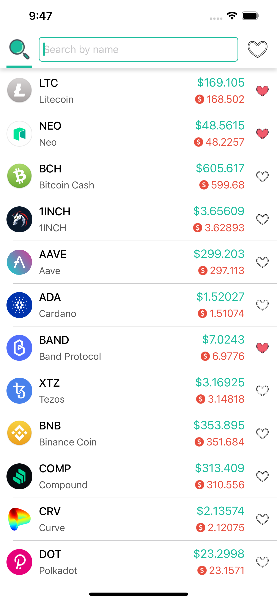
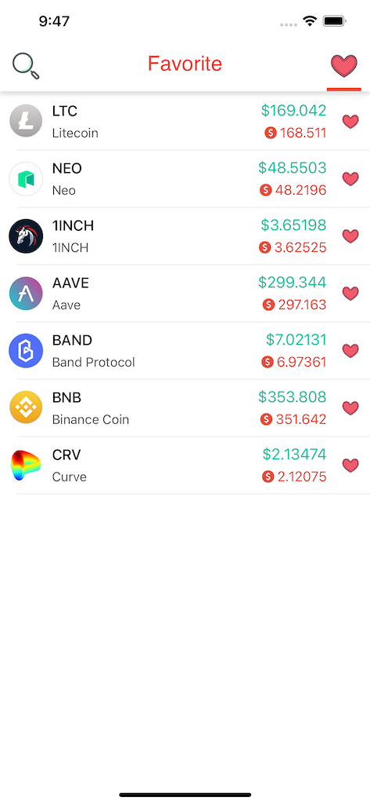
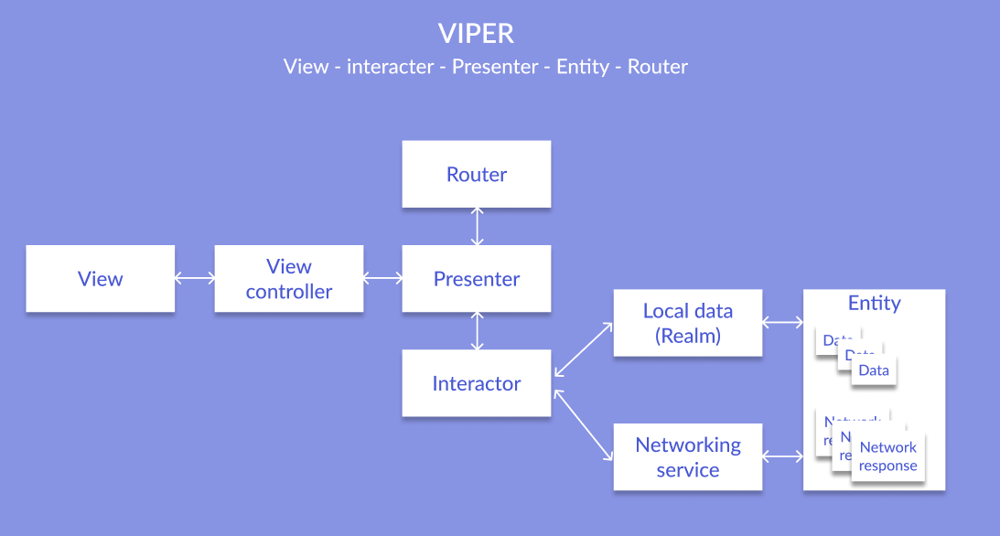
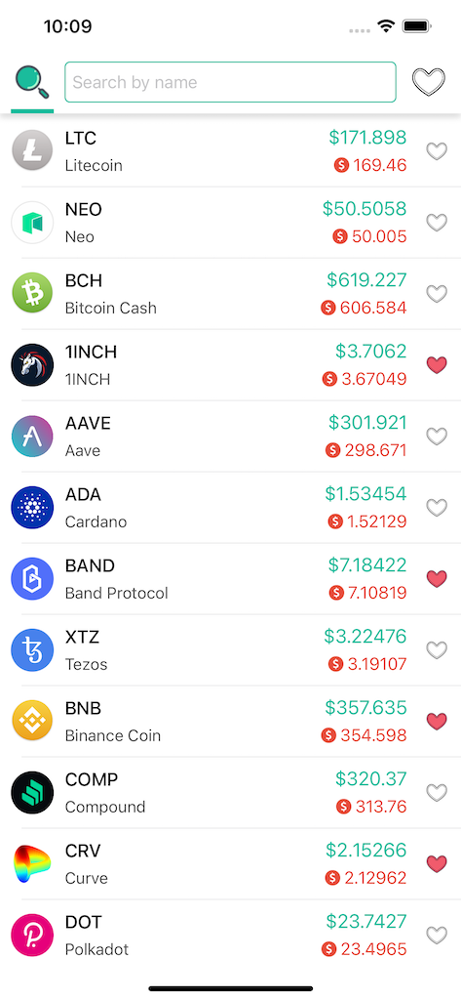
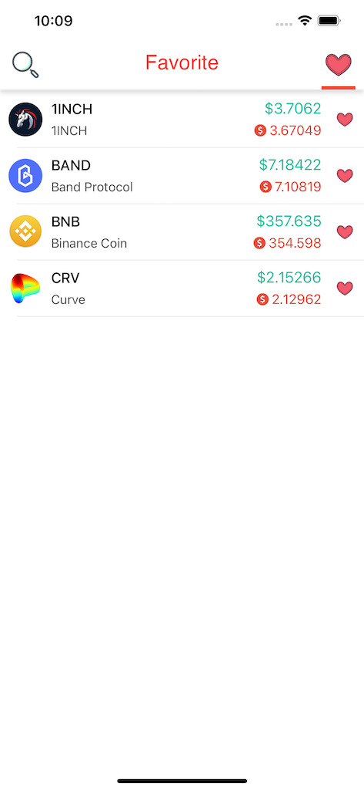
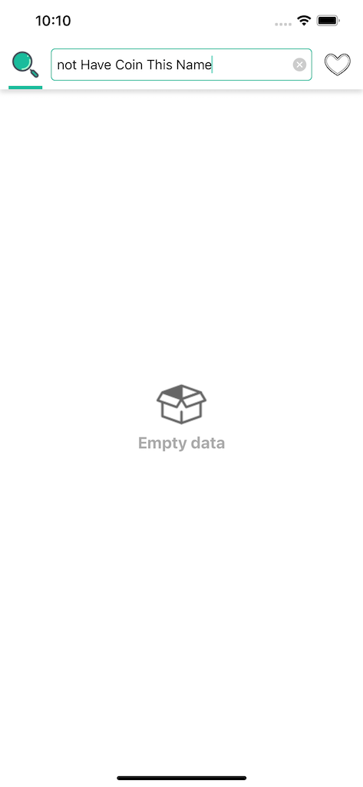

# Crypto Currency Wallet
- From CH Resource VietNam we want to improve the current digital currencies wallet and for that purpose we want to build a new mobile application to help users to enjoy quick and secure access to the wallet.
- The Goal for this project is to let users view their digital currencies wallet easiest. Users can search, add their favorite currencies.

## Demo
| Search | Favorite |
|-----|-----|
|||

## Getting Started

- Clone or download this repository
- Run and feel free to use this app without any account

## Features

- Add update price real time (each 30s)
- Add search functions for names to find currencies.
- Add favorite currencies

## Architecture - VIPER

- The **View** is the user interface.
- The **Interactor** is a class that mediates between the presenter and the data. It takes direction from the presenter.
- The **Presenter** is the “traffic cop” of the architecture, directing data between the view and interactor, taking user actions and calling to router to move the user between views.
- An **Entity** represents application data.
- The **Router** handles navigation between screens

## UI-Test

| ID | UI | Description | Input | Expected Output | Actual Output | Test Result |
| ------------- | ------------- | ------------- |  ------------- | ------------- |  ------------- | ------------- |
| UTC01 | Search view |  Check action of search view | Tap search or favorite button or swipe left and swipe right on screen |  |  | Passed | 
| UTC02 | Empty Search |  Check list empty of currency when search | Type *not Have Coin This Name* |  |  | Passed |

## Libraries and Frameworks
- Model parser with *ObjectMapper* and *SwiftJSON*
- Network: *Alamofire* with layer architecture
- Layout: *ConstraintLayout - Xib* and *Snapkit*
- Database: *Realm*
- Image: *SDWebImage*
- Loading: *SkeletonView*

## Scripts
- Image: Auto generate enum image from Assets by type in terminal: *ruby (direction [image.rb])*
- Localizable: Auto generate enum string from file *Localizable.string* by type in terminal: *swiftgen*
